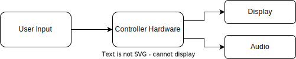

# Design Document Ram Race

| Name              | Student number |
| ----------------- | -------------- |
| Bram Scheepers    | 2152377        |
| Joas Onvlee       | 2170887        |
| Jochem Wabbijn    | 2169436        |
| Maarten Dullemond | 2150474        |
| Tim Laheij        | 2167667        |

| Version | Edited by         | Comment                   | Date       |
| ------- | ----------------- | ------------------------- | ---------- |
| 0.1     | Maarten           | Initial Setup             | 07/03/2022 |
| 0.2     | Maarten and Bram  | added subjects and topics | 07/03/2022 |
| 0.3     | Bram              | Rebuilding document       | 03/04/2022 |
| 0.4     | Everyone          | Process Feedback          | 06/04/2022 |
| 1.0     | Everyone          | Finish first version      | 06/04/2022 |
| 1.1     | Tim and Bram      | Setup document to rewrite | 11/04/2022 |

# Table of contents

1. [Introduction](#introduction)
2. [Architecture](#architecture)
3. [Design](#design)
4. [Conclusion](#conclusion)

# 1. Introduction 
In the 7th quarter of the study Computer Science at Avans University of Applied Sciences, students are tasked to make a retro game based on dedicated hardware. Our client, Bob van der Putten, is a game developer himself. He creates games for PC, but would like to see one developed on dedicated hardware. Unfortunatly Bob does not know how to create one on dedicated hardware with a limited amount of recources, therefor he would like us to find out how to create one. In this document, the design choices are described for the system. This document structures the design to accomplish the desired output which is described in the [game design document](https://jjtbm-games.github.io/design/gamedesign).

##### Base Context Diagram 

# 2. Architecture 

## 2.1 Top level decisions
The elements described in this chapter are the top level decisions of the system. When these elements are changed, all decisions below can be discarded, because they are intertwined with the top level decisions. The top level decisions are the foundation of the system.

### 2.1.1 Hardware Controller (Bram)

The hardware controller used for the game will be chosen based on a couple of key factors. These factors are the ability to:
- Output visuals to an external display.
- Output sound to an external speaker.
- Receive input from an external controller.
- Handle the game logic.

When looking at the key abilities needed from the controller, two options come to mind. These options are:
- A standalone FPGA.
- An FPGA connected to a microcontroller.
- A microcontroller build on an FPGA.

The game can be made in both hardware (FPGA) and software (µC). Since the use of a FPGA is mandatory there has to be made a choice whether to use software or not. When connecting an external microcontroller to a FPGA, the microcontroller has to be able to send and receive data trough a communication protocol. This protocol could unnecessarily increase the complexity of the system.

To circumvent the communication issue, the microcontroller might be build directly on the FPGA. This could be done by implementing the microblaze on, for example the Basys 3 FPGA. This microblaze could then be used to handle the game logic. The problem with this approach is that the microblaze would use a lot of resources, which are then not available for the FPGA to handle visualizations from memory.

The use of only an FPGA eludes both the communication issue and the memory issue. Since the FPGA can handle both the game logic and visualization on its own, a standalone FPGA will be used.

In the situation where the use of a standalone FPGA creates bottlenecks in the system, the external microcontroller could be used to handle the game logic.

Taking this decision into account, the [context diagram](#ContextDiagramBase) shown in the introduction is updated to the following:

##### Controller Context Diagram 

### 2.1.2 Display interface 

The display interface used for the game will be determined according to a list of requirements. 
These are:

* Hardware limitations
* Clock speeds

Even though these requirements bring a great list of options, 
the choice of the Basys 3 FPGA makes this list of options quite small. 
Using the Basys 3 FPGA, the options are limited down to one: a VGA interface.

As the Basys 3 FPGA comes with a dedicated VGA port, using this interface will be the only option and therefor the chosen one.

Taking this decision into account, the [context diagram](#ContextDiagramController) shown in the Hardware Controller chapter is updated to the following:

##### Controller Context Diagram 

### 2.1.3 Distributed vs Dedicated memory 
There are multiple ways of saving sprites on an FPGA. As this is an essential part of how to game on the Basys 3 FPGA will work, it will be treated as a top level descision. The type of memory used will have impact on clock speeds and memory size.

For this project, there are two main criterea that are important in making a memory type choice:

* The least amount of memory must be used while storing something.
* Delays in retrieving data must be low.
* Cannot have a big impact on project build time.

To choose an option, a table has been made covering the different aspects of each of the memory types.

|               | Distributed                        | Dedicated                 |
|  :--          | :--                                | :--                       |
| Resource cost | High                               | Low                       |
| Memory Delay  | None                               | 3 clock cycles            |
| Build time    | Very long when read multiple times | IP core is generated once |

Based on this table, the choice has been made to use Dedicated memory. Eventhough there is a memory delay of three clock cycles, the delay is not big enough to be a problem in the scope of this project.

### 2.1.4 Development environment

#### 2.1.4.1 IDE
The development environment used in this project is Vivado 2019.1. The older version is used because of prior experience with the software. As all group members had this version installed, it was the chosen software package. 

#### 2.1.4.2 Software management
The software management strategy used in this project is an interpretation of the gitflow. Whenever a new feature needs to be implemented, an issue is made on github. This issue is than linked to a new branch called: feature-(feature number)

### 2.1.5 File structure strategy (Tim)
The complete development of the game has been done in the VHDL language. The different aspects of the game, like controls, display and game logic, have been split up in separate blocks. Due to this decision, it is possible to add or alter features in a more streamlined manner. Together with the version management tool "Git", it is possible to let different programmers work on separate features and implement them into a final solution.

The strategy that has will be used for the file structure of this project is a structure based on hardware components.

As seen in the diagram above, a main level will be used to combine all the different hardware components. Every software file that is created will be sorted in one of the categories in the diagram. for example, a VGA controller will be placed in the VGA catagory.

# 3. Design 

## 3.1 Clocks  (Tim)
To build a working system on the basys 3 FPGA, multiple clock speeds are needed. As mentioned in the [Display interface](#DisplayInterface) chapter, VGA will be used to display the game. Furthermore, it has been decided that dedicated memory blocks will be used to save sprites on the FPGA. In this chapter, the clock speeds themselves will not be determined, but the ratio between the clock speeds will be logically calculated.

The things a clock is needed for are:

* clock for VGA
* clock for ROM memory
* clock for calculations

The clock for VGA will be chosen in a later chapter. However, one thing that can already be decided is that the VGA clock will be used as a reference base clock. This is because the display must render everything after it has been calculated or read. Therefor, the VGA clock will be used as base. The second clock that will be used is for calculations. Based on the VGA position on screen, calculations will be made as to which ROM memory must be read. Using this information, the calculations must be at least twice as fast as the VGA clock. Lastly, a clock is needed for ROM. A memory block takes three clock cycles to retrieve it's data. Because of this, the memory blocks already need a speed that is at least three times the baseclock. However, since the ROM will be called based on calculations. The speed chosen for memory blocks will be 3 times as fast as the calculation clock.

Taking these criterea into account the clock speed ratios are as follows:

* clock for VGA : Base clock
* clock for calculations : Base clock * 2
* clock for ROM memory : Calculation clock * 3

## 3.2 VGA Resolution (Tim) 
The resolution of the game was chosen by examining a couple of factors. These factors were:
* The resolution must be high enough to fit the desired playing field size for the game. At least 30 X 30 grid cells.
* The grid cell size must maintain at least 16x16 pixels.
* The resolution must be able to run on a Basys 3 FPGA, which has a board clock of 100MHz, without impacting calculation speed and memory speed.
 
Before it was possible to make a choice on which timings would be used, the different possibilities that vga had to offer had to be known. Luckily a website called [tiny VGA](https://tinyvga.com/vgatiming) had the answer to this question. The website offers all possible vga timing sheets and describes what type of clock speed would be needed to achieve these timings.

The board clock of a Basys 3 FPGA is 100MHz. Because ROM memory will be used to render surroundings on the screen. Because these ROM memory blocks take at least three clock cycles to send their data back to a Rendering controller, the clock speed of the VGA resolution must be less than 33 MHz. This would allow the memory blocks to be rendered with 99Mhz which is within the 100MHz clock on the FPGA board.

When taking this into account, a couple of options come forth on the [tiny VGA](https://tinyvga.com/vgatiming) website:
* 640 X 350 @ 70Hz (25.175MHz)
* 640 X 400 @ 70Hz (25.175MHz)
* 640 X 480 @ 60Hz (25.175Mhz)

As one of the criterea for the resolution is a playing field with a minimum size of 30x30 cells, the resolution that has been chosen is 640 X 480 @ 60Hz. If a cell size of 16X16 is used, a playing field of 40 X 30 cells is realised. 

## 3.3 Game Logic (Joas) 

The game logic for the Ram Race game should be reliable and easy to change.
At the top of the game logic are the different states of the game,
decisions on the implementation of the different states are described first.

### 3.3.1 State machine 
The Ram Race game has multiple requirements having to do with game logic states:

* Start menu state
* Name selection state (could have)
* Current level state
* Highscore state (could have)
* Credit screen state

A state machine is the perfect implementation of the different state requirements described above.
This is because a state machine will decide when to move on to the next state.
All of this is implemented in a central location which makes it reliable and easy to change.
The designed state machine with the implemented states from the requirements looks like this:

### 3.3.2 Rendering 

The most important part of the game logic is the logic behind the screen rendering.
As the described in the [display interface](#DisplayInterface) part, VGA is chosen as the display interface.
Also the [vga resolution](#vga-resolution) part explains the best choise for the resolution to render.
With the information of both parts a VGA rendering controller can be designed.
The [vga resolution](#vga-resolution) part also explained why a playing field/grid of 40x30 cells is used.
The basic needs for the rendering logic will be:

* Display controller (for calculating VGA values)
* Grid controller (for current cell and cell pixel)
* VGA controller (for controlling the output lines of the display interface)

Down here is the rendering logic in the form of a activity diagram. The diagram only goes from one controller to the other,
there are no lines going back. This is because you want to prevent feedback on FGPA systems because they will result in timing issues.
In this case the VGA controller needs the display and grid controller but the display and grid controller do not need the VGA controller.

### 3.3.3 Movement and Collision 

With the use of the grid and cell system described in [vga resolution](#vga-resolution) it is very easy to detect collision.
The most imported collision detection is between the wall/border and the players.
If the player can go past a wall in non-cheat mode the game will be broken. In the rendering part above is shown that the grid controller calculates the current cell number and cell pixel. With this information it can be checked if a player is standing next to a border/wall and if the player is allowed to move.
This design is further explained with the help of the diagram below:

Whith the 'set player condition' activity variables are set that allow a player to move or not based on the current position of the player.
It is also visible that when cheatmode is on, the 

## 3.4 User Input 
The user input method used for the game will be chosen based on a couple of key factors. These factors are the ability to:
- Move the player.
- Start the game.
- Select the player name.
- Give an old school feeling to the game.

Based on these factors, there are a few different user input methods that can be used. These options are: 
- a Gamepad 
- or a Joystick in combination with buttons

Off the shelf gamepads usually are connected trough USB. Since the FPGA board has only one USB port and the game requires two user input devices, the gamepad is not an option.

Joysticks give the ability to build an all in one arcade cabinet with the controls integrated. Using the joystick the player is able to move the game character left, right, up and down and scroll through the alphabet to select the player name. The gamepad is still an option, since it would be possible to create a diy gamepad, but the joystick is the preferred method. Together with the joystick, buttons will be used to start the game.

Taking this decision into account, the [context diagram](#ContextDiagramVGA) shown in the Display interface chapter is updated to the following:

##### User Input Context Diagram 

### 3.4.1 Debouncing 
When using buttons, like the switches in a joystick, the phenomenon called *bouncing* might occur. This *bouncing* may cause the system to recognize one button press as two or more button presses. To prevent this, the buttons need to be *debounced*. There are two ways to debounce buttons:
- Hardware debouncing
- and Software debouncing.

Hardware debouncing could be implemented in the following manner:

With software debouncing the button presses are recognized when they have not changed for a certain amount of time.

Both the hardware and software debouncing are usable. The hardware debouncing is the most reliable and the software debouncing is the most flexible. The software debouncing is the most flexible because it is possible to change the amount of time the button has to be pressed to be recognized. This creates the ability to change the game speed.

## 3.5 Sound (Jochem) 

The project must contain some sort of music and some sort of sound effects (SFX). Sound can be done in a few different ways on the FPGA.

The first option could be to store audio files into block memory and play these using PWM. A coe file can be generated using a Mathlab script and loaded into block memory. Using this method can cost a lot of memory. The files need to be compressed in order to be fitted onto the FPGA. The compressed files will lose a lot of quality.

Another option would be to make a simple synthesizer on the FPGA to generate sound. This won't take up a lot of memory, generate a cleaner signal. However, there is less detail in the sound.
For this project it is needed to make a simple syntheseizer since this won't be limited by the used memory.

The synth made on the FPGA will be a square wave syntheseizer. In order to generate both music and SFX, two synths are needed. First of all the clock will be divided to the correct frequentie needed for the notes to be played. The used frequenties are displayed in the table below. 

This divided clock can be used to generate a square wave with a 50% duty cycle. This is done by toggeling a line between on and off on the divided clock. This setup can now play notes to a output. However, it is needed to play music out of the speakers and not a single note. To get this done, another clock divider can be made which runs the desired beats per minute (bpm). This divided clock can be used to run through a array which contains nibbles with the note information. In the unit which will tell which note to play, will also contain multiple music arrays, which make it possible to play different music compositions. The selection of music, will be bound to a state of the game.

The same system is build for the SFX. However, the SFX will play in a faster pace, since they need to be short and this will have the added benefit of adding more detail to the SFX. 

Taking this decision into account, the [context diagram](#ContextDiagramUserInput) shown in the User Input chapter is updated to the following:

##### Audio Context Diagram 

# 4. Conclusion 

# Aantekeningen ( weghalen )
----------------------------------------------
- Hoofdstuknummers
- Linken naar de eisen
- Opbouw:
  - **Eisen (criterea)** 
  - Opties
  - Keuze

Views:

- logical
- Physical
  - Hardware
- Process
  - Processen binnen systeem
- Development
  - Bijv gitflow

##  1. Inleiding

- Bij inleiding moet er een plaatje. Een context diagram van wat je op het moment van het beginnen al weet.
- Inleiding:
  - Probleemstelling
  - Doelstelling
  - Wat is het nu eigenlijk

##  2. Architectuur

- Hoofdbeslissing
  - sequentieel process of concurrent
- Ontwikkelomgeving
- Blokken ( folders )
- Hoofdinterfaces
  - VGA ( display keuze mag je dus al maken )

##  3. Ontwerp

- Game logic
- Collision
- Sound
- gebruik van state machine
- Meer uitleg over hoe bijv rondlopen of dingen op pakken werkt.

##  4. Conclusion

- Resultaten. Wat werkt wel, wat werkt maar kan beter etc.