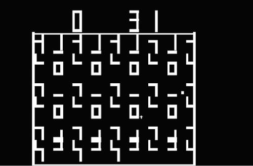
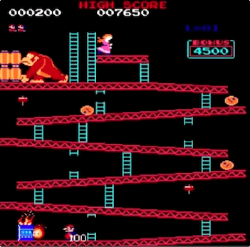
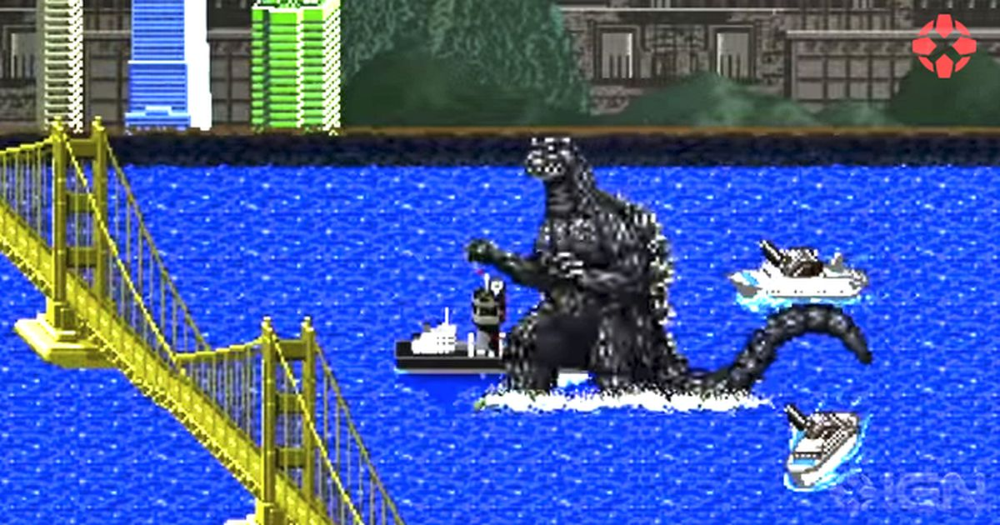

# Design Document

| Name              | Student number |
| :---------------- | :------------- |
| Bram Scheepers    | 2152377        |
| Joas Onvlee       |                |
| Jochem Wabbijn    |                |
| Maarten Dullemond | 2150474        |
| Tim Laheij        | 2167667        |

| Version | By         | Date          |
| ------- | ---------- | ------------- |
| 0.1     | Tim Laheij | Initial Setup |
| 0.2     | Tim Laheij | Divergin ideas|
|         |            |               |

# Table of contents

# Introduction

# Diverging Ideas 

## Maze game

### Idea creator

* Tim Laheij

### Short introduction

In this game, a player is tasked to solve a maze as fast as possible. Levels are randomly generated to make every level unique. The game also consists of a multiplayer mode. In the 2-player mode, two players compete against each other to solve a maze as fast as possible. Collectable power-ups can be used by a player to for example, invert the opponents controls for a period of time, or to interact with the players environment. 

### Unique Selling Points

| Element                   | Reason                                                       |
| ------------------------- | ------------------------------------------------------------ |
| Randomly generated levels | Randomly generated levels allow endless playability of the game. No two levels are alike, this could be compared to [The amazing maze](https://en.wikipedia.org/wiki/The_Amazing_Maze_Game) game. |
| Multiplayer mode          | The multiplayer mode introduces a fun way to compete with friends. |
| Power-ups                 | Introducing power-ups gives players a fun twist to casual gameplay. |
| Completing a maze         | The maze aspect of this game introduces a puzzle aspect to the game. This makes the game a puzzle game. |

### Inspirations

| Name                                                         | Image                        |
| ------------------------------------------------------------ | ---------------------------- |
| [Gotcha](https://en.wikipedia.org/wiki/Gotcha_(video_game))  |       |
| [Berzerk](https://en.wikipedia.org/wiki/Berzerk_(video_game)) |      |
| [The amazing maze game](https://en.wikipedia.org/wiki/The_Amazing_Maze_Game) |  |

### Technical challenges

| Name                      | Reason                                                       |
| ------------------------- | ------------------------------------------------------------ |
| Randomly generated levels | Making randomly generated levels is something that requires knowledge of pathfinding and maze generating algorithms. |
| Multiplayer gameplay      | The multiplayer aspect makes developing the game more challenging because developers now have to add another form of input and they have to make it possible for two characters to be controlled. |
| Making power-ups          | The power-ups in this game allow for interaction with the environment and with the other player. This will be a challenge as the environment will have to be dynamic. |

### Gameplay

Character mechanics:

* Move left-right
* Move up-down
* Pick up power-ups
* Interact with environment

Player actions:

* Solve a maze as fast as possible.
* Use power-ups to interact with the environment.
* Use power-ups to negatively impact the other players performance.

* In solo-mode, beat high scores.

## Monkey rampage

### Idea creator

* Maarten Dullemond

### Short introduction

The player, a monkey, is tasked to destroy a city. For every building that the player destroys, points are added to the score. The game procedurally gets harder with NPC police shooting at the player to try and stop the rampage from happening. Power-ups can be used to make the player stronger. Once the player has been taken out, the score is saved to the scoreboard.

### Unique selling points

| Name                       | Reason                                                       |
| -------------------------- | ------------------------------------------------------------ |
| Destroying the environment | The destruction of elements in the environment allows the player to gather points. |
| NPC's                      | The NPC's in the game provide an extra challenge to the player as the game progresses. |
| High score                 | The scoreboard motivates the player to keep playing in order to beat a previous high score. |

### Inspirations

| Name                                                         | Image                                             |
| ------------------------------------------------------------ | ------------------------------------------------- |
| [Donkey Kong](https://en.wikipedia.org/wiki/Donkey_Kong_(video_game)) |                       |
| [Godzilla](https://en.wikipedia.org/wiki/Godzilla_(1983_video_game)) |  |

### Technical challenges

| Name                         | Reason                                                       |
| ---------------------------- | ------------------------------------------------------------ |
| Interaction with environment | Interaction with environment requires the environment to be dynamic. |
| NPC                          | A non playable character must be programmed to target the player. |

### Gameplay

Character mechanics:

* Move left-right
* Move up-down
* Pick up power-ups
* Interact with environment
* Action

Player actions:

* Player must destroy city as much as possible.
* Player must dodge bullets from NPC's.
* Player must get the highest score.

# Converging Idea

# Gameplay

# Typical level

The playing field consists of a square divided into a right and left side. Each player is assigned a side in which he/she must reach the end of an identical mirrored maze before the opposing player does. Enemies are scattered throughout the maze, which shoot periodically. By deviating from the fastest path and taking a power up you also have the option to shoot. you can then shoot an enemy or smash a wall to speed through the maze.
The challenge lies in the risk-reward ratio. You can choose to take a risk by taking a power up, where you have the chance to be shot by an enemy or you can try to reach the end without a power up.

# Technical requirements

