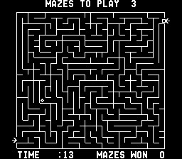

# The Amazing Maze Game

#### Created by: Midway Manufacturing Co.

### Description

Created in 1976, The Amazing Maze Game was one of the first maze games ever produced. It is a multiplayer competitive game were you must get to the other end of the maze before your opponent. It is also possible to play against the computer or in a single player mode where you race against the clock.

##### Selling points

- Joystick control
- Endless levels
- Multiplayer
- Time based highscore
